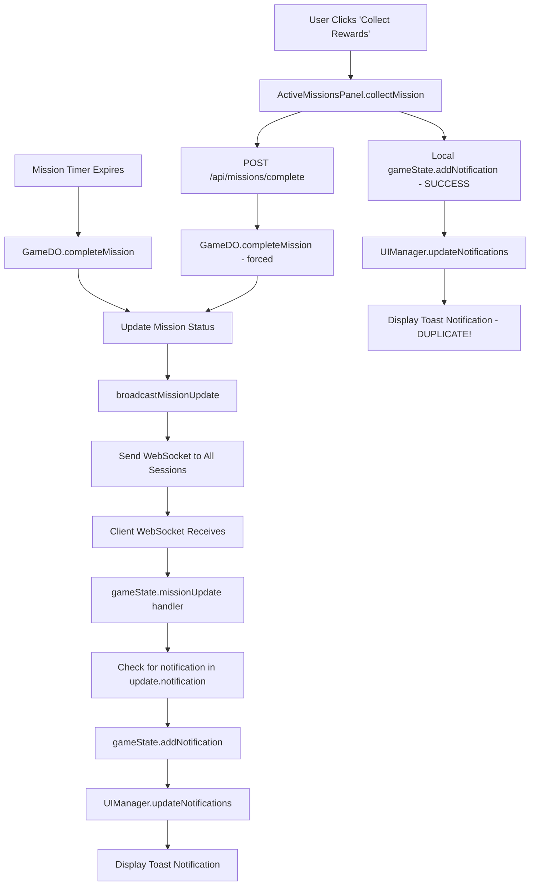

# Current Notification Pipeline Analysis

## Mission Completion Notification Flow



## Duplication Sources Identified

### 1. **Double Server Broadcast**
- **Auto-completion**: GameDO completes mission naturally → broadcasts
- **Manual collection**: User clicks "Collect" → API call → GameDO completes again → broadcasts again

### 2. **Client-Side Additional Notification**
- `ActiveMissionsPanel.collectMission()` (lines 263-267) creates its own SUCCESS notification
- This happens BEFORE the server broadcast arrives
- Result: User sees both client-generated success + server-generated completion

### 3. **WebSocket Reconnection Replays**
- Current deduplication in `gameState.ts` (lines 214-224) only checks existing notification IDs
- On reconnect, old notifications can be replayed because client state was cleared
- No server-side memory of what was already delivered

### 4. **Mission Status Race Conditions**
- Mission can show as "COMPLETE!" in UI while still marked as 'active' in server
- User clicks collect → triggers completion → but mission was already completing naturally
- Both paths execute nearly simultaneously

## Current Deduplication Attempts (Insufficient)

### Client-Side (gameState.ts:214-224)
```typescript
// Add new notifications to the existing list
const existingIds = new Set(this.state.notifications.map(n => n.id));
const newNotifications = uiNotifications.filter(n => !existingIds.has(n.id));
```
**Problem**: Only works within single session, fails on reconnect

### Server-Side
**Problem**: No deduplication at all - every broadcast is sent to every session regardless

## Files Involved in Notification Flow

1. **Server-Side**
   - `server/game-do.ts` - Mission completion, broadcasting
   - `server/routes/missions.ts` - Manual completion API

2. **Client-Side**  
   - `client/gameState.ts` - WebSocket handling, notification management
   - `client/ui/UIManager.ts` - Notification display
   - `client/ui/ActiveMissionsPanel.ts` - Manual collection, duplicate generation
   - `shared/models.ts` - Notification data structures

## Proposed Fix Architecture

Replace current "broadcast and hope" with proper **acknowledgment-based delivery**:

1. **Server Tracking**: GameDO maintains `pendingNotifications: Map<sessionId, Set<notificationId>>`
2. **ACK Protocol**: Client ACKs each notification received  
3. **Replay Logic**: On reconnect, only resend unacknowledged notifications
4. **Single Source**: Eliminate duplicate emission paths

This ensures **exactly-once delivery** per session.
