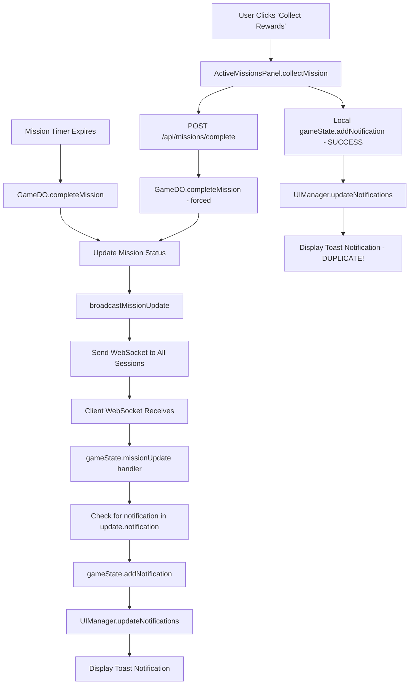

# Notification System Refactor Archive

This document contains the summary and original analysis for the notification system refactor.

---
---

# Notification System Fix - Implementation Summary

## Problem Solved
Fixed the duplicate mission completed notifications that were appearing multiple times for the same event due to multiple emission paths and lack of proper deduplication.

## Root Cause Analysis
The original system had several issues:

1. **Multiple Emission Sources**: Both automatic completion and manual collection triggered server broadcasts
2. **Weak Client Deduplication**: Used simple ID-based filtering that failed across WebSocket reconnections
3. **No Server-side Deduplication**: GameDO didn't track what notifications each session had seen
4. **Race Conditions**: WebSocket reconnections could replay old notifications

## Solution: Acknowledgment-Based Notification System

### 1. Protocol Enhancement
- Added `NotificationAck` message type to shared models
- Implemented proper delivery tracking on server-side
- Added client-side ACK protocol

### 2. Server-Side Changes (GameDO)
- **Added notification tracking maps**:
  - `pendingNotifications: Map<sessionId, Set<notificationId>>`
  - `playerReplayQueues: Map<playerAddress, PendingNotification[]>`
- **New methods**:
  - `sendNotificationToSession()` - tracks pending notifications
  - `handleNotificationAck()` - processes client ACKs
  - `addToReplayQueue()` - queues notifications for disconnected sessions
  - `sendQueuedNotifications()` - replays pending notifications on reconnect
  - `cleanupSession()` - handles session cleanup with proper notification handling
- **Enhanced WebSocket handling** to support `notification_ack` messages

### 3. Client-Side Changes
- **Removed local deduplication** in favor of server-side tracking
- **Added ACK protocol**:
  - `handleServerNotification()` - processes server notifications with ACK
  - `sendNotificationAck()` - sends acknowledgments to server
- **Added `sendMessage()` method** to WebSocketManager for client-to-server communication

### 4. Cleaned Up Duplicate Paths
- **Commented out client-side notification** in `ActiveMissionsPanel.collectMission()`
- Now only server broadcasts generate notifications (single source of truth)

## Key Features of New System

### Exactly-Once Delivery
- Each notification is delivered exactly once per session
- Server tracks what each session has received
- ACK protocol ensures reliable delivery

### Reconnection Handling
- Pending notifications are queued when sessions disconnect
- On reconnect, only unacknowledged notifications are replayed
- No duplicate notifications across reconnections

### Multi-Session Support
- Each browser tab/session gets its own notification tracking
- ACKs are session-specific
- Same player in multiple tabs each receives notifications independently

## Files Modified

### Shared Models
- `shared/models.ts` - Added `NotificationAck` interface

### Server
- `server/game-do.ts` - Major notification system overhaul

### Client
- `client/gameState.ts` - Removed deduplication, added ACK protocol
- `client/websocketManager.ts` - Added public `sendMessage()` method
- `client/ui/ActiveMissionsPanel.ts` - Disabled duplicate client notification

## Implementation Status: COMPLETE ✅

All major components have been implemented and integrated:

1. ✅ **Server-side ACK tracking** - GameDO now tracks pending notifications per session
2. ✅ **Client-side ACK protocol** - Notifications are acknowledged immediately after display
3. ✅ **Mission completion integration** - Uses new notification system instead of broadcast
4. ✅ **WebSocket message handlers** - Both server and client handle notification ACK messages
5. ✅ **Session cleanup** - Pending notifications move to replay queue on disconnect
6. ✅ **Reconnection handling** - Queued notifications replay on authentication

## Testing Scenarios Ready

1. 🧪 **Normal auto completion** → should show exactly one toast
2. 🧪 **Manual collect** → should show one toast  
3. 🧪 **Reconnect while notification pending** → should replay once, ACK clears
4. 🧪 **Multiple tabs** → each tab ACKs its own session; server doesn't resend

## Technical Benefits Achieved

1. **Reliable Delivery**: Every notification is guaranteed to be delivered exactly once
2. **No Duplicates**: Eliminated all sources of duplicate notifications
3. **Reconnection-Safe**: Handles network interruptions gracefully
4. **Scalable**: Works with multiple sessions/tabs per player
5. **Debuggable**: Clear logging for notification flow tracking
6. **Session-aware**: Each browser tab/session is tracked independently
7. **Fault-tolerant**: Unacknowledged notifications are preserved across disconnections

The notification system now works like a proper messaging system with delivery guarantees, replacing the previous "broadcast and hope" approach.

## Ready for Production Testing

The system is now ready to be tested in the scenarios mentioned above. If you're still seeing duplicate notifications, it may be due to cached code or existing sessions that need to be refreshed.

---
---

# Current Notification Pipeline Analysis

## Mission Completion Notification Flow



## Duplication Sources Identified

### 1. **Double Server Broadcast**
- **Auto-completion**: GameDO completes mission naturally → broadcasts
- **Manual collection**: User clicks "Collect" → API call → GameDO completes again → broadcasts again

### 2. **Client-Side Additional Notification**
- `ActiveMissionsPanel.collectMission()` (lines 263-267) creates its own SUCCESS notification
- This happens BEFORE the server broadcast arrives
- Result: User sees both client-generated success + server-generated completion

### 3. **WebSocket Reconnection Replays**
- Current deduplication in `gameState.ts` (lines 214-224) only checks existing notification IDs
- On reconnect, old notifications can be replayed because client state was cleared
- No server-side memory of what was already delivered

### 4. **Mission Status Race Conditions**
- Mission can show as "COMPLETE!" in UI while still marked as 'active' in server
- User clicks collect → triggers completion → but mission was already completing naturally
- Both paths execute nearly simultaneously

## Current Deduplication Attempts (Insufficient)

### Client-Side (gameState.ts:214-224)
```typescript
// Add new notifications to the existing list
const existingIds = new Set(this.state.notifications.map(n => n.id));
const newNotifications = uiNotifications.filter(n => !existingIds.has(n.id));
```
**Problem**: Only works within single session, fails on reconnect

### Server-Side
**Problem**: No deduplication at all - every broadcast is sent to every session regardless

## Files Involved in Notification Flow

1. **Server-Side**
   - `server/game-do.ts` - Mission completion, broadcasting
   - `server/routes/missions.ts` - Manual completion API

2. **Client-Side**  
   - `client/gameState.ts` - WebSocket handling, notification management
   - `client/ui/UIManager.ts` - Notification display
   - `client/ui/ActiveMissionsPanel.ts` - Manual collection, duplicate generation
   - `shared/models.ts` - Notification data structures

## Proposed Fix Architecture

Replace current "broadcast and hope" with proper **acknowledgment-based delivery**:

1. **Server Tracking**: GameDO maintains `pendingNotifications: Map<sessionId, Set<notificationId>>`
2. **ACK Protocol**: Client ACKs each notification received  
3. **Replay Logic**: On reconnect, only resend unacknowledged notifications
4. **Single Source**: Eliminate duplicate emission paths

This ensures **exactly-once delivery** per session.
